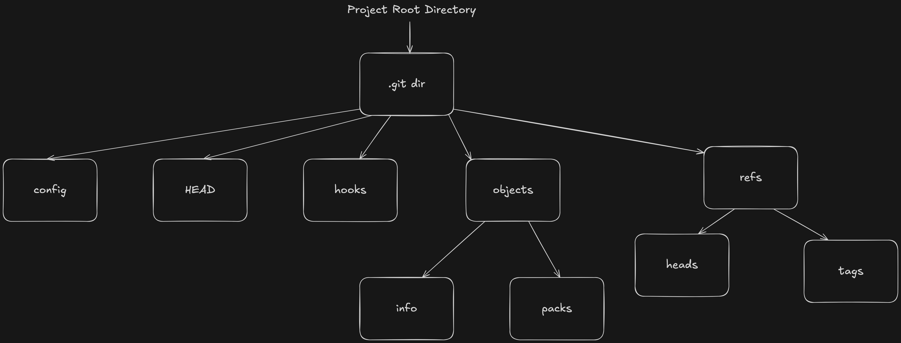
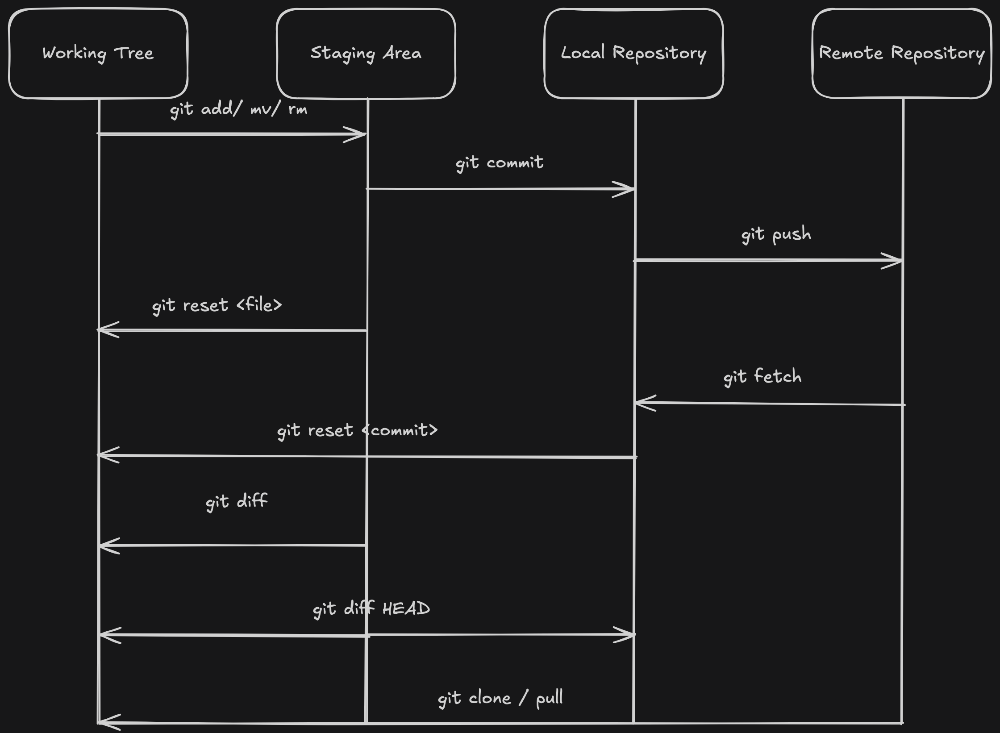

# Design Documentation

## What is Git?

Git is a distributed version control system that tracks changes in computer files over time.

## .git Directory Breakdown

When we run `git init` in our project, it creates a `.git` directory under the project's root directory.

- `config`: It stores project-specific Git configurations
- `HEAD`: It contains the current head of the repository. If you are currently on the `master` directory, HEAD will point to `refs/head/master`.
- `hooks`: It contains any script that can be run before/after git does anything.
- `objects`: It stores all the commits, files, and histories in a compressed format using SHA hashes. `info` and `pack` are subfolder related to how Git stores and compresses those objects.
- `refs`: It contains references (pointers) to commits.
  - `heads/` contains branches.
  - `tags/` contains tags.

## Git Architecture

Git has three-stage model optimized for tracking changes: **the working directory**, **staging area** and **local repository**. Additionally, Git includes the concept of **remote repositories** for collaboration.

1. **Working Directory:** This is the actual folder where the project files and folders are saved. Modifications made to files in the working directory are considered 'untracked' until explicitly staged for commit.
2. **Staging Area (or Index):** The staging area acts as an intermediate step between the working directory and the .git directory. When you run `git add file.txt`, the file is moved from working tree to staging area. These files are staged to be included in the next commit.
3. **Local Repository:** This is the `.git` folder in your computer. It holds all the previous commits, branch history and objects. When you run `git commit`, Git takes everything from the staging area to local repository and saves a snapshot.
4. **Remote Repository:** This is a copy of your Github repository that is hosted online, which allows multiple developers to work on the same code and collaborate. The changes are pushed using `git push`. You can view changes made by other devs using `git pull`.

A typical workflow will look like:

- A developer edits files in the working tree.
- `git add` -> Stage them in the staging area.
- `git commit` -> Save them to your local repository.
- `git push` -> Send them to the remote repository (eg. Github)
