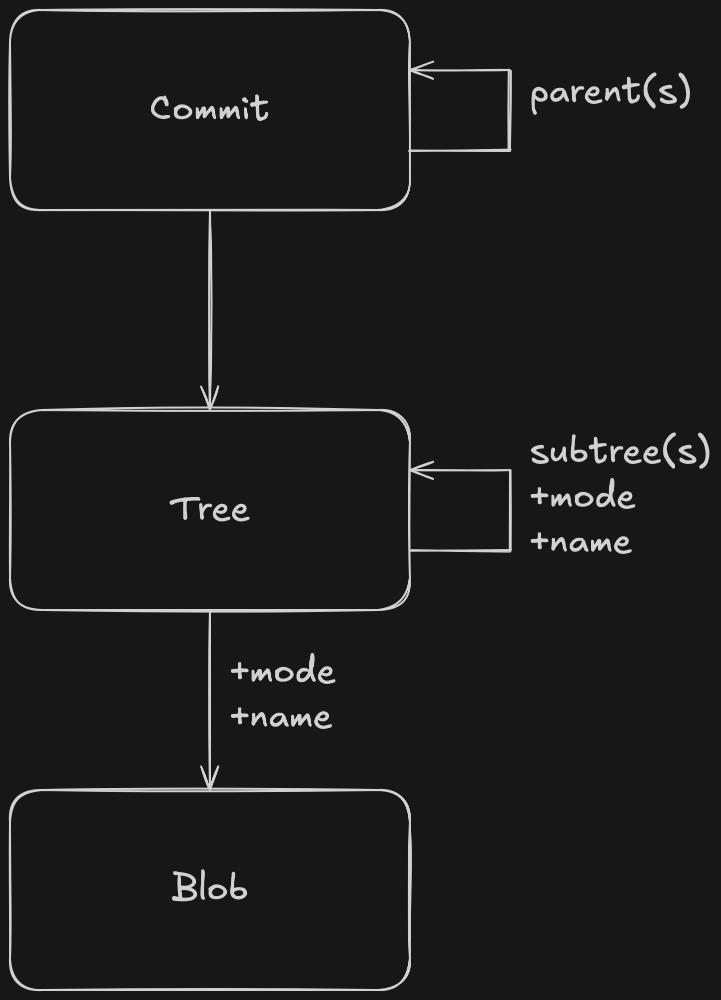

# Git Implementation: Code Walkthrough

This document provides a detailed walkthrough of the implementation for a custom **Git** system built in **Python**. It explains how the system is structured, what each class/function does, and how the code works together to replicate key Git functionalities.

---

## Table of Contents

| Section                            | Link                                                                    |
| :--------------------------------- | :---------------------------------------------------------------------- |
| Overview                           | [Overview](#overview)                                                   |
| Core Components                    | [Core Components](#core-components)                                     |
| Main Entry Point                   | [Main Entry Point](#main-entry-point)                                   |
| Functions Explained                | [Functions Explained](#functions-explained)                             |
| Internal Design Details            | [Internal Design Details](#internal-design-details)                     |
| Final Notes                        | [Final Notes](#final-notes)                                             |
| Git Object Relationships (Diagram) | [Git Object Relationships (Diagram)](#git-object-relationships-diagram) |

---

## Overview

The project builds a lightweight version of Git, capable of:

- Initializing repositories.
- Creating and managing Git objects (blobs, trees, commits).
- Reading and displaying Git objects.
- Cloning a remote Git repository using Git protocol v2.

## Core Components

### Enums

- `ObjectType`: Enumerates Git object types like `COMMIT`, `TREE`, `BLOB`, `TAG`, etc.
- `Mode`: Defines file modes like `FILE`, `DIRECTORY`, `SYMLINK`, and `EXECUTABLE`.

### Class: `TreeEntry`

Represents an entry in a tree object:

- `mode`: Mode of the object (file or directory).
- `name`: Name of the file or folder.
- `hash`: SHA-1 hash of the object.

## Main Entry Point

### Function: `main()`

The starting point of the program. It parses command-line arguments and matches them to corresponding functions using **match-case** syntax.

Commands supported:

- `init`
- `cat-file -p`
- `hash-object -w`
- `ls-tree`
- `write-tree`
- `commit-tree`
- `clone`

---

## Functions Explained

### `init_repo(path: Path)`

- Initializes a Git repository at the given path.
- Creates `.git/objects` and `.git/refs/heads` folders.
- Writes `HEAD` to point to `refs/heads/main`.

### `cat_file(object_hash: str)`

- Reads and decompresses a Git object by its SHA-1 hash.
- Prints the content part (after skipping the header).

### `hash_file(path: str, write: bool = True) -> str`

- Reads a file.
- Prepares a blob object (`blob <size>\0<content>`).
- Computes SHA-1.
- Optionally writes it to `.git/objects/`.

### `hash_tree(path: str, write: bool = True) -> bytes`

- Recursively scans a directory.
- Hashes all files as blobs.
- Hashes subdirectories as trees.
- Prepares a tree object by combining all entries.

### `write_tree()`

- Calls `hash_tree()` from the current directory.
- Stores the resulting tree object.
- Prints the tree's SHA-1 hash.

### `commit_tree(commit_message: str, commit_sha: str, tree_sha: str)`

- Creates a commit object linking to a tree and parent commit.
- Includes author, committer, timestamps, and commit message.
- Writes the commit to `.git/objects/`.

### `ls_tree(tree_hash: str, arg: str)`

- Lists the contents of a tree object.
- Supports `--name-only` option to print only file names.

### `read_object(path: Path, sha: str) -> (str, bytes)`

- Reads and decompresses a Git object.
- Splits header and content.

### `write_object(path: Path, obj_type: bytes, content: bytes) -> str`

- Prepares an object (`<type> <size>\0<content>`).
- Compresses and writes it to the appropriate `.git/objects/` subfolder.

### `get_object_type_name(obj_type: int) -> str`

- Converts an integer object type code to its string name.

### `read_varint(data: bytes, pos: int) -> (int, int)`

- Parses Git-style variable-length integers (used in deltas).

### `decompress_object(data: bytes, expected_size: int) -> (bytes, bytes)`

- Decompresses zlib-compressed object data.
- Ensures output size matches expectation.

### `apply_ref_delta(base_obj_hash, delta_data, dest_path)`

- Rebuilds a full object from a ref-delta base and delta instructions.
- Handles copy and insert operations.

### `build_tree(path: Path, folder: Path, sha: str)`

- Reconstructs a working directory from a Git tree object.
- Recursively creates files and folders.

### `clone_repo(dest_dir, url_string)`

- Clones a repository by communicating using Git's HTTP protocol.
- Steps:
  - Sends `ls-refs` to get references.
  - Sends `fetch` to get objects.
  - Parses received packfile.
  - Unpacks and reconstructs objects.
  - Rebuilds working directory tree.

### `extract_references(data: str) -> dict[str, str]`

- Parses the Git server's response to extract branch names and SHA-1s.

## Internal Design Details

- All Git objects are stored compressed in `.git/objects/<first-two-chars>/<remaining-chars>`.
- Tree entries use raw 20-byte SHA-1 references.
- Commits link trees and previous commits.
- Compression is done using `zlib` at best speed.
- Git's delta compression for packfiles is supported via ref-delta application.

## Git Object Relationships (Diagram)

- **Blob**: Stores file contents.
- **Tree**: Maps file names to blobs (and subdirectories).
- **Commit**: Points to a tree and records project history.

---
